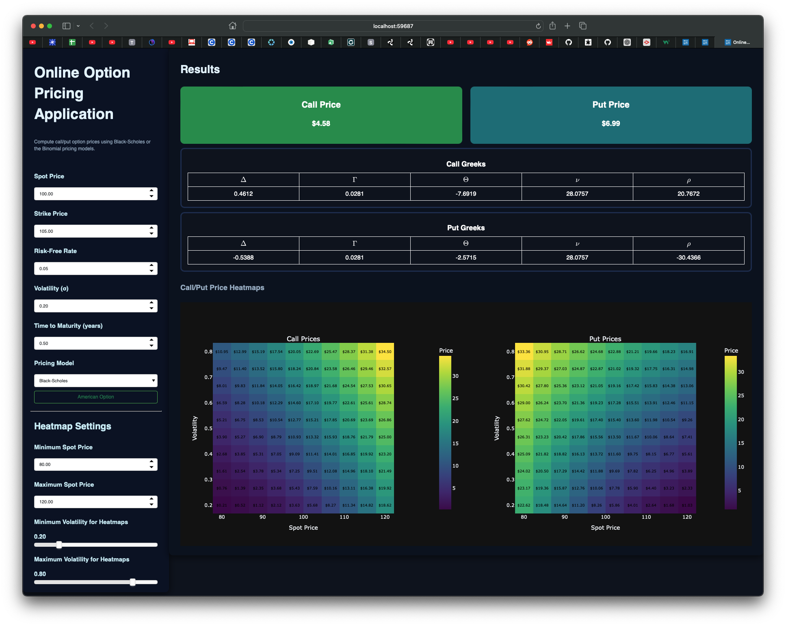

# Online Options Pricing Application

Online options pricing application. Call/Put options can be priced using the Black-Scholes pricing model or the Cox-Ross-Rubinstein (Binomial) model. Both call and put greeks are computed live for each pricing models.



### Requirements & Installation

- Python 3.11, 3.12 or 3.13. Other versions have not been tested !
- [Poetry](https://python-poetry.org/docs/)

Then clone this repository:
```bash
git clone git@github.com:Larsdb98/online-options-pricing-app.git
```

And install the project with Poetry:
```bash
poetry install
```

## Launch locally:

```bash
poetry run options
```
